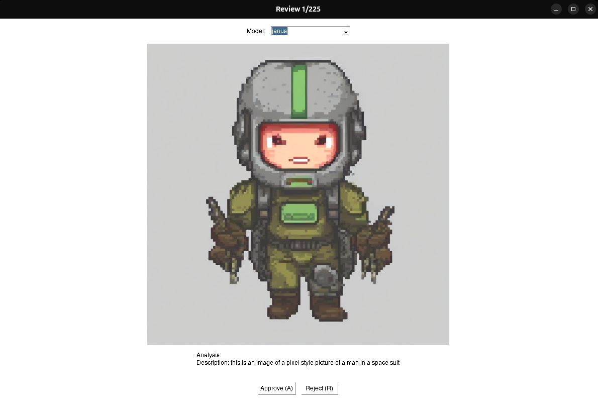

Multi-Vision Toolkit 🖼️ 🤖
A comprehensive Python toolkit for local deployment of state-of-the-art vision models (Florence-2 and BLIP). Process images with advanced computer vision capabilities including object detection, image captioning, OCR, and visual analysis.
🏗️ Model Architectures
Florence-2 Model Architecture

BLIP Model Architecture


## 🚀 Key Features
- Supports multiple vision models:
  - Florence-2: Advanced vision tasks including object detection, OCR, and visual analysis
  - BLIP: High-quality image captioning and visual understanding
- Multi-task capabilities:
  - Image captioning
  - Object detection
  - OCR (Florence-2)
  - Visual Question Answering (Florence-2)
- Batch processing support
- Easy-to-use GUI interface with model switching
- Dataset preparation for AI training
- JSON metadata tracking

## 🛠️ Installation

### Prerequisites
- Python 3.11
- CUDA-capable GPU (recommended)
- At least 8GB VRAM for Florence-2
- At least 4GB VRAM for BLIP

### Option 1: Using pip (Recommended)
```bash
# Create conda environment
conda create -n vision-env python=3.11
conda activate vision-env

# Install PyTorch with CUDA support
conda install pytorch torchvision pytorch-cuda=11.8 -c pytorch -c nvidia

# Install core dependencies
pip install -r requirements.txt
```

### Option 2: Manual Installation
```bash
# Create conda environment
conda create -n vision-env python=3.11
conda activate vision-env

# Install PyTorch with CUDA support
conda install pytorch torchvision pytorch-cuda=11.8 -c pytorch -c nvidia

# Install core dependencies
pip install transformers>=4.36.0 
pip install Pillow>=9.0.0 
pip install timm>=0.9.12 
pip install einops>=0.7.0
pip install python-dotenv>=1.0.0
pip install opencv-python>=4.8.0
pip install matplotlib>=3.5.0
pip install accelerate>=0.25.0
pip install safetensors>=0.4.0
```

## 📁 Project Setup
```bash
# Create directories
mkdir -p data/{review,approved,rejected}
```

## 🎯 Usage

### Basic Usage
```bash
python main.py --review_dir data/review --approved_dir data/approved --rejected_dir data/rejected
```

### With Model Selection
```bash
# Use Florence-2 (default)
python main.py --review_dir data/review --model florence2

# Use BLIP
python main.py --review_dir data/review --model blip
```

### With Trigger Word
```bash
python main.py --review_dir data/review --trigger_word "your_trigger" --model florence2
```

### Florence-2 Model Variants
```bash
# Use large model (0.77B parameters)
python main.py --review_dir data/review --model florence2 --variant large

# Use base model (0.23B parameters)
python main.py --review_dir data/review --model florence2 --variant base
```

## 💻 GUI Features
- Model switching dropdown
- Image preview
- Multi-task analysis display
- A/R keys for approve/reject
- Automatic metadata tracking
- Progress tracking

## 📝 Supported Formats
- Images: `.jpg`, `.jpeg`, `.png`
- Auto-resizing enabled
- Metadata: `.json`, `.txt`

## 🔗 Model Capabilities

### Florence-2
- Advanced image captioning
- Object detection
- OCR
- Visual Question Answering
- Zero-shot learning capabilities
- Supports both base (0.23B) and large (0.77B) variants

### BLIP
- High-quality image captioning
- Visual understanding
- Robust performance on various image types
- Public model with no authentication required

## 🔧 Troubleshooting

### Common Issues
1. CUDA/GPU Memory Issues
   - For Florence-2 base model: Use `--variant base` for lower VRAM usage
   - Ensure no other GPU processes are running
   - Monitor GPU memory usage with `nvidia-smi`

2. Model Loading Issues
   - Clear transformers cache: `rm -rf ~/.cache/huggingface/`
   - Update transformers: `pip install --upgrade transformers`
   - Check internet connection for model downloads

3. Image Processing Errors
   - Verify image format support
   - Check image file permissions
   - Ensure sufficient disk space

## 📈 Performance Notes
- Florence-2 large (0.77B): Best for complex visual tasks
- Florence-2 base (0.23B): Good balance of performance and resource usage
- BLIP: Excellent for image captioning, lower resource requirements

## 📄 License
Apache License 2.0

## 🤝 Contributing
Pull requests welcome! See CONTRIBUTING.md for guidelines.
